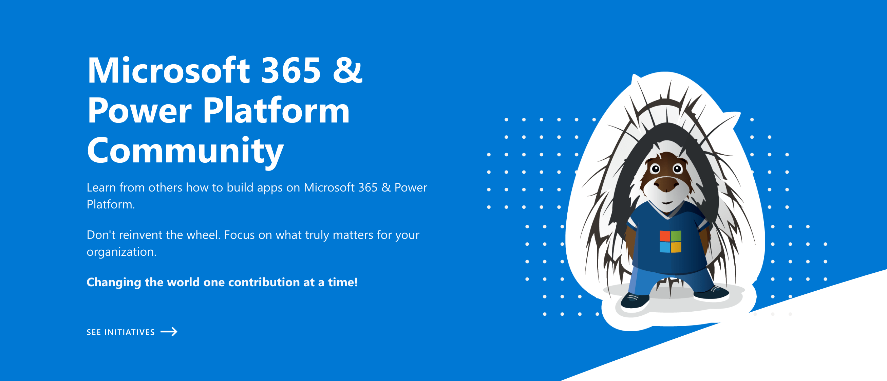

# Hack Together: Microsoft Graph and .NET 🦒

  

  

## Hack Together: Microsoft Graph and .NET 🦒

From March 1-15, 2023 we ran **Hack Together: Microsoft Graph and .NET** - a virtual hackathon for beginners to get started building scenario-based apps using .NET and Microsoft Graph.

In this hackathon, participants learned how to build apps with Microsoft Graph based on top Microsoft Graph scenarios, and met Microsoft Graph Product Group Leaders, Cloud Advocates, MVPs and Student Ambassadors. Each submitted app had a chance to win exciting prizes.

## We're excited to share the hackathon winners

- 🥇 1st place: [Magic Note app to plan the day efficiently with AI & Microsoft Graph](https://github.com/microsoft/hack-together/issues/92)
- 🥈 2nd place: [ScheduleEase](https://github.com/microsoft/hack-together/issues/178)
- 🥉3rd place: [magi – An AI wizard to answer all your queries](https://github.com/microsoft/hack-together/issues/140)

**Congratulations to the winners and a huge thank you to all participants!**

Read the [full announcement](https://devblogs.microsoft.com/microsoft365dev/announcing-the-hack-together-microsoft-graph-and-net-winners/)

## Continue your journey

While the hackathon is finished, your journey doesn’t have to end. [Join the Microsoft 365 and Power Platform Community](https://pnp.github.io/) to continue building with Microsoft Graph and .NET. **Find like-minded people, attend community calls, and explore resources to see what else you can build using Microsoft Graph!**

## Hack Together Roadmap 🗺️

Follow the steps below to successfully complete the hackathon.

### Watch the sessions 🎥

* **[March 1st - Watch On Demand 🎥](https://aka.ms/hack-together/session01):** Kickoff Hack Together: Microsoft Graph and .NET! What can you do with Microsoft Graph .NET SDK?

* **[March 2nd - Watch On Demand 🎥](https://aka.ms/hack-together/session02):** Microsoft Graph Product Managers will show you how to get started with Microsoft Graph .NET SDK!

* **[March 8th - Watch On Demand 🎥](https://aka.ms/hack-together/session03):** Microsoft Graph Product team and .NET Advocates join the Ask the Experts session to answer your questions. Get to know them!

* **[March 15th - Watch On Demand 🎥](https://aka.ms/hack-together/session04):** We're at the end of Hack Together, but the journey doesn't end here. What's next: learn how you can join the community!

## Recommended Learning Materials

* [Learn Path - Explore Microsoft Graph scenarios for ASP.NET Core development](https://learn.microsoft.com/training/paths/m365-msgraph-dotnet-core-scenarios/)
* [Tutorial - Build .NET apps with Microsoft Graph](https://learn.microsoft.com/graph/tutorials/dotnet?tabs=aad)
* [Tutorial: Create a Blazor Server app that uses the Microsoft identity platform for authentication](https://learn.microsoft.com/azure/active-directory/develop/tutorial-blazor-server)
* [Tutorial: Call the Microsoft Graph API from a Universal Windows Platform (UWP) application](https://learn.microsoft.com/azure/active-directory/develop/tutorial-v2-windows-uwp)
* [Tutorial: Create a .NET MAUI app using the Microsoft Graph SDK](https://learn.microsoft.com/windows/apps/windows-dotnet-maui/tutorial-graph-api)
* [Documentation - Overview of Microsoft Graph](https://learn.microsoft.com/graph/overview)

## Templates

If you are looking for a code template to start your project, we have the following templates available for you in this repository:

* [Console App](https://github.com/microsoft/hack-together/tree/main/templates/dotnet-console-app-microsoft-graph)
* [Blazor Server App](https://github.com/microsoft/hack-together/tree/main/templates/dotnet-blazor-server-app-microsoft-graph)
* [UWP (Universal Windows Platform) App](https://github.com/microsoft/hack-together/tree/main/templates/dotnet-uwp-app-microsoft-graph)
* [MAUI (Multi-platform App UI) App](https://github.com/microsoft/hack-together/tree/main/templates/dotnet-maui-app-microsoft-graph)
* [.NET Core MVC (Model - View - Controller) Web App](https://github.com/microsoft/hack-together/tree/main/templates/dotnet-core-mvc-web-app-microsoft-graph)

---

  

  

