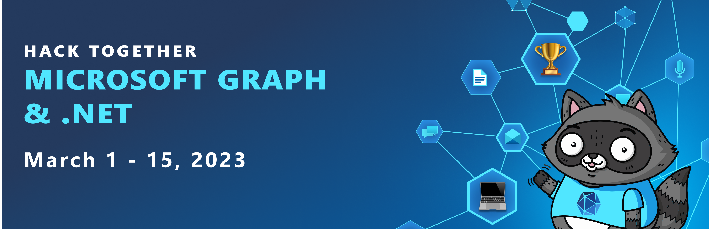
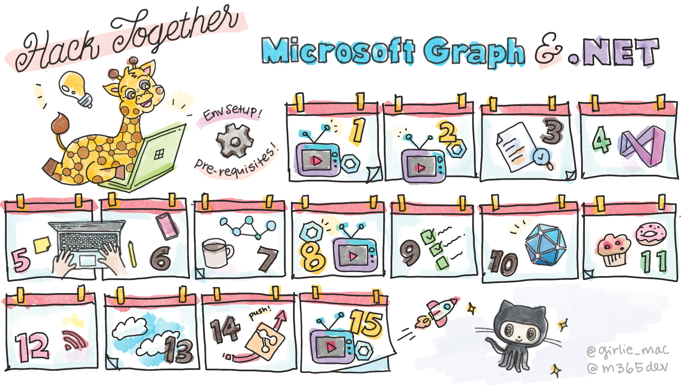

# Hack Together: Microsoft Graph and .NET 🦒

  

  

## Introduction

**Hack Together: Microsoft Graph and .NET** is a hackathon for beginners to get started building scenario-based apps using .NET and Microsoft Graph.

In this hackathon, you will kick-start learning how to build apps with Microsoft Graph and develop apps based on the given Top Microsoft Graph Scenarios, for a chance to win exciting prizes while meeting Microsoft Graph Product Group Leaders, Cloud Advocates, MVPs and Student Ambassadors.

The hackathon starts on **March 1st** and ends on **March 15th**. It is recommended for participants to follow the Hack Together Roadmap for a successful hackathon.

### Tips & Tricks

* Whenever you struggle during the hackathon, ask your questions on **[❓GitHub Discussions](https://github.com/microsoft/hack-together/discussions)**. Microsoft experts will be there to help you.
* There is a list of **[📃 Top Microsoft Graph Scenarios](/top-scenarios.md)** available! You may build one of these scenarios to win a digital badge, or get inspired and build your own project ideas!
* Looking for documentation and guidance? Check out **[📚 Recommended Learning Materials](https://github.com/microsoft/hack-together#recommended-learning-materials)** below.
* Looking for code templates to start with? Check out available **[✨ Templates](https://github.com/microsoft/hack-together#templates)** in the repository.
* Submit your project until March 15 to win the **[🏆 Prizes](https://github.com/microsoft/hack-together#prizes-)**.

## Hack Together Roadmap 🗺️

Follow the steps below to successfully complete the hackathon.

### #00 - Pre-requisites

Register to Hack Together: 

  

Before you start hacking, you will need an environment setup. Review **[Environment Setup](/setup.md)** guidelines or the following prerequisites or click the related link of each prerequisite to be directed to the official documentation:

* [Prepare your Office 365 tenant](/setup.md#1---prepare-your-microsoft-365-tenant)
* [Install Visual Studio or Visual Studio Code with .NET](/setup.md#2---install-visual-studio-or-visual-studio-code-with-net)
* [Setup your GitHub account](/setup.md#3---setup-your-github-account)

### #01 - Start hacking on March 1st

Either team-up or join by yourself, join the hacking! Make sure to register to Hack Together and complete the pre-requisites before starting to build your project.

### #02 - Join live Reactor sessions for learning and inspiration

  

* **[March 1st - Join Live 📺](https://aka.ms/hack-together/session01):** Kickoff Hack Together: Microsoft Graph and .NET! What can you do with Microsoft Graph .NET SDK?

* **[March 2nd - Join Live 📺](https://aka.ms/hack-together/session02):** Microsoft Graph Product Managers will show you how to get started with Microsoft Graph .NET SDK!

* **[March 8th - Join Live 📺](https://aka.ms/hack-together/session03):** Microsoft Graph Product team and .NET Advocates join the Ask the Experts session to answer your questions. Get to know them!

* **[March 15th - Join Live 📺](https://aka.ms/hack-together/session04):** We're at the end of Hack Together, but the journey doesn't end here. What's next: learn how you can join the community!

### #03 - Submit your project until March 15th

You may submit your project here when it's ready: **[🚀 Project Submission](https://github.com/microsoft/hack-together/issues/new?assignees=&labels=&template=project.yml&title=Project%3A+%3Cshort+description%3E)**

Check out this video for step by step project submission guidance:

<https://user-images.githubusercontent.com/11164679/217246172-0aaea858-a4be-4fb8-abf2-beebfc1544ef.mp4>

## Recommended Learning Materials

* [Learn Path - Explore Microsoft Graph scenarios for ASP.NET Core development](https://learn.microsoft.com/en-us/training/paths/m365-msgraph-dotnet-core-scenarios/)
* [Tutorial - Build .NET apps with Microsoft Graph](https://learn.microsoft.com/en-us/graph/tutorials/dotnet?tabs=aad)
* [Tutorial: Create a Blazor Server app that uses the Microsoft identity platform for authentication](https://learn.microsoft.com/azure/active-directory/develop/tutorial-blazor-server)
* [Tutorial: Call the Microsoft Graph API from a Universal Windows Platform (UWP) application](https://learn.microsoft.com/azure/active-directory/develop/tutorial-v2-windows-uwp)
* [Tutorial: Create a .NET MAUI app using the Microsoft Graph SDK](https://learn.microsoft.com/windows/apps/windows-dotnet-maui/tutorial-graph-api)
* [Documentation - Overview of Microsoft Graph](https://learn.microsoft.com/en-us/graph/overview)

## Templates

If you are looking for a code template to start your project, we have the following templates available for you in this repository:

* [Console App](https://github.com/microsoft/hack-together/tree/main/templates/dotnet-console-app-microsoft-graph)
* [Blazor Server App](https://github.com/microsoft/hack-together/tree/main/templates/dotnet-blazor-server-app-microsoft-graph)
* [UWP (Universal Windows Platform) App](https://github.com/microsoft/hack-together/tree/main/templates/dotnet-uwp-app-microsoft-graph)
* [MAUI (Multi-platform App UI) App](https://github.com/microsoft/hack-together/tree/main/templates/dotnet-maui-app-microsoft-graph)
* [.NET Core MVC (Model - View - Controller) Web App](https://github.com/microsoft/hack-together/tree/main/templates/dotnet-core-mvc-web-app-microsoft-graph)

## Prizes 🏅
The winners will receive the following exciting prizes (up to 4 individuals if submitting as a team, prizes for each person on the team): 

**🥇 First prize winner:**
* an Xbox,
* $200 gift card
* $100 Azure credit
* a digital Credly badge

**🥈 Second prize winner:**
* $200 gift card
* $100 Azure credit
* a digital Credly badge

**🥉 Third prize winner:**
* $100 Azure credit
* a digital Credly badge

**🏅 All hackathon participants who submit an app will receive a digital badge.**

---
**ℹ️ Hack Together winners will be selected as per the following judging criterias:** 
1. Does the app work?
2. Does the app use the Microsoft Graph .NET SDK?
3. Does the app creative, innovative and polish?
---

  

  

