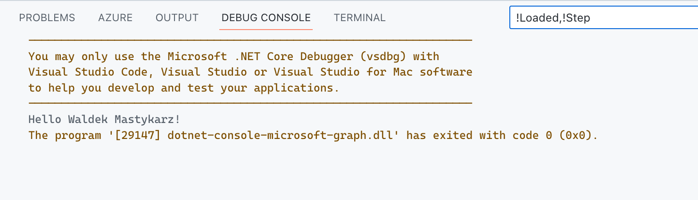

# .NET v7.0 console app connected to Microsoft Graph

This is a template for a console application built using .NET v7.0 that connects to Microsoft Graph.

## Minimal Path to Awesome

- [install Azure CLI](https://learn.microsoft.com/cli/azure/install-azure-cli?view=azure-cli-latest) if you don't have it already,
- register your app on Microsoft cloud, by creating a new Azure AD app registration:
  - on macOS/Linux/in Bash:
    - open terminal and change the working directory to the root of this project
    - to make the setup script executable, run `chmod +x ./setup.sh`
    - to register the app, run `./setup.sh`
    - when prompted, sign in with your **Microsoft 365 developer sandbox account**
  - on Windows/in PowerShell:
    - open PowerShell and change the working directory to the root of this project
    - to register the app, run `.\setup.ps1`
    - when prompted, sign in with your **Microsoft 365 developer sandbox account**
- back in VSCode, press F5 to run the app
  
